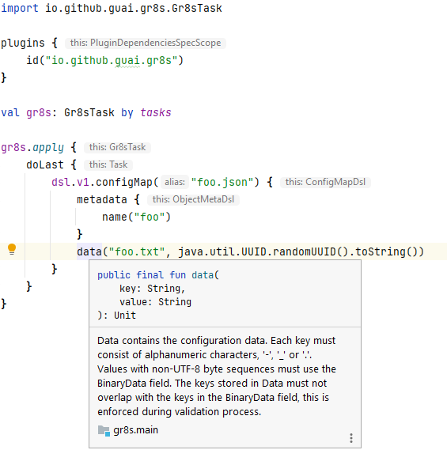

# gr8s

Gradle plugin which allows using typed DSL for generating kubernetes/openshift files.  
Based on [kuberig](https://github.com/kuberig-io/kuberig)

## Usage

```
import io.github.guai.gr8s.Gr8sTask

plugins {
	id("io.github.guai.gr8s")
}

val gr8s : Gr8sTask by tasks

gr8s.apply {
	doLast {
		dsl.v1.configMap("foo.json") {
			metadata {
				name("foo")
			}
			data("foo.txt", java.util.UUID.randomUUID().toString())
		}
	}
}
```

See more detailed example [here](https://github.com/guai/gr8s/blob/main/build.gradle.kts)

Some hints are available:


The DSL is generated from OpenShift's swagger spec, which you can get with `oc get --raw /openapi/v2 > swagger.json`
